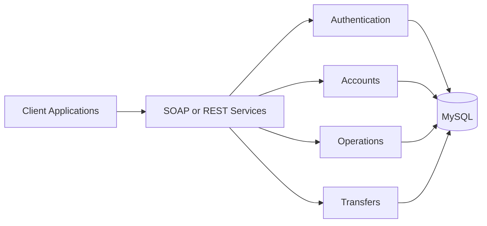

# EurekaBank Java Microservices

This project splits the EurekaBank Java backend into focused SOAP and REST services.

## Overview

The backend is divided into authentication, accounts, operations, and transfer services. Console, desktop, web, and Android clients show how both service styles can be used.

## Main Features

- User authentication service
- Account and balance service
- Deposit and withdrawal service
- Money transfer service
- Movement queries
- SOAP and REST client examples

## Architecture



The SOAP and REST versions are separate. Both divide the main banking tasks into service modules.

## Applications

| Application | Technology | Purpose |
| --- | --- | --- |
| SOAP services | Java and JAX-WS | Provide separate banking services |
| REST services | Java and JAX-RS | Provide separate banking services |
| Console clients | Java | Use services from a terminal |
| Desktop clients | Java Swing | Provide a desktop interface |
| Web clients | JSP and Servlets | Provide browser access |
| Mobile clients | Kotlin / Android | Provide mobile access |

## Tech Stack

### Backend

- Java
- Jakarta EE
- JAX-WS
- JAX-RS

### Clients

- Java Swing
- JSP and Servlets
- Kotlin and Android

### Database

- MySQL
- SQL setup scripts

### Tools

- Maven
- Gradle

## Project Structure

```text
eurekabank-java-microservices/
├── 01.SOAP_JAVA_EUREKABANK_GR05/
└── 03.RESTFUL_JAVA_EUREKABANK_GR05/
```

Each architecture has client modules and separate backend service modules.

## Getting Started

Prepare the database with the included SQL scripts. Set `DB_URL`, `DB_USER`, and `DB_PASSWORD` as shown in `.env.example`. Build and start the required service modules from their `pom.xml` folders. Then start the selected client. Open Android clients in Android Studio.

## Screenshots

Screenshots will be added soon.

## Academic Context

This group project was developed as part of a university course. The main goal was to practice service separation and compare SOAP with REST.
